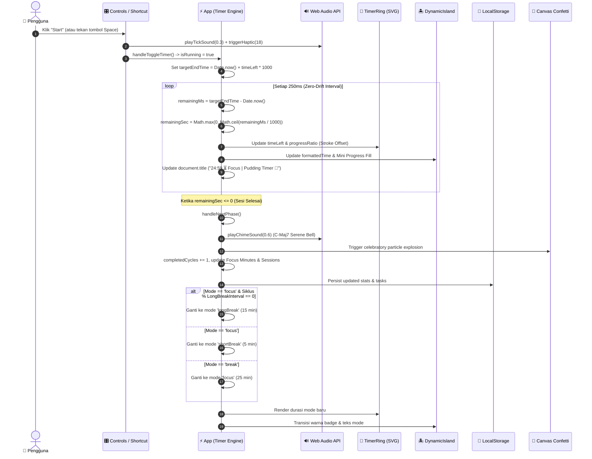
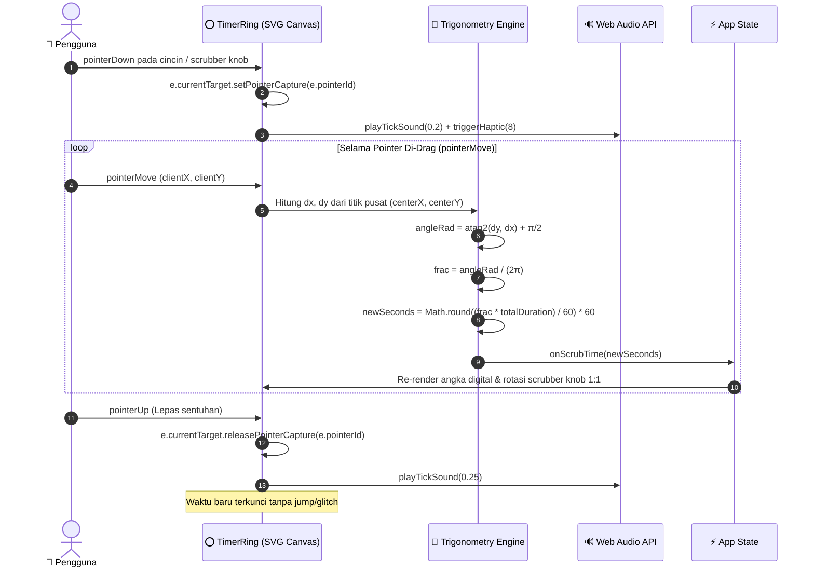
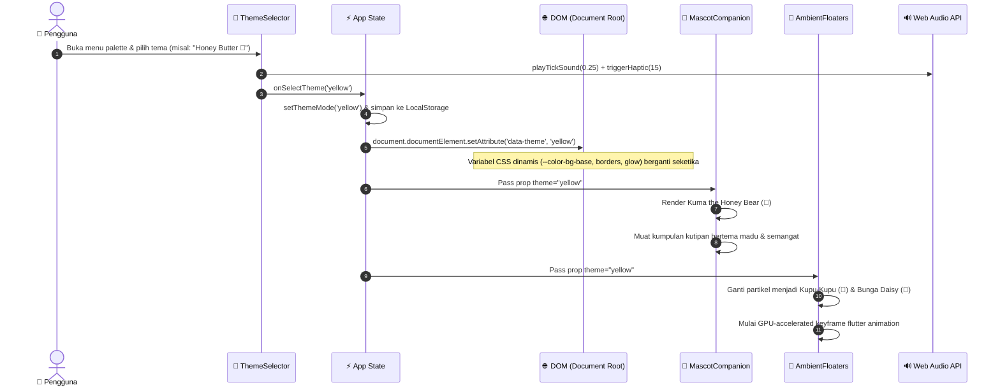

# 🍮 Pudding Timer — Architecture, Sequence Diagrams & Data Flow

Dokumentasi arsitektur sistem, alur data (*data flow*), dan *sequence diagram* lengkap untuk aplikasi web **Pudding Timer (🍮)** yang dibangun berdasarkan prinsip **Apple WWDC Human Interface Guidelines** dan teknologi web modern.

---

## 🏛️ 1. High-Level System Architecture

Aplikasi Pudding Timer dirancang dengan pola **Unidirectional Data Flow** (aluran data searah), pemisahan modul yang bersih (*modular separation of concerns*), dan mesin suara prosedural tanpa dependensi aset eksternal.

```mermaid
graph TD
    subgraph UI_Layer ["🖥️ Presentation Layer (React + Apple Glassmorphism)"]
        Navbar["Top Navigation & Dynamic Island"]
        ThemePicker["ThemeSelector (Pastel Palettes 🌸🍯🫧🍵)"]
        Mascot["MascotCompanion (Pomi 🐰, Kuma 🐻, Mochi 🐱, Kero 🐸)"]
        Floaters["AmbientFloaters (Sakura, Butterflies, Bubbles, Clovers)"]
        TimerDial["TimerRing (Direct Manipulation SVG Dial)"]
        ModeControl["ModePill (iOS Segmented Glass Pill)"]
        ActionControls["Controls (Tactile Play / Pause / Reset / Skip)"]
        Rings["ActivityRings (Apple Fitness 3-Concentric Rings)"]
        Tasks["TaskReminders (Apple Reminders Task List)"]
        SoundBar["AmbientSoundBar (Focus Soundscape Controls)"]
        Modal["SettingsModal (macOS Translucent Preferences Sheet)"]
    end

    subgraph State_Engine ["⚙️ State & Logic Orchestrator (App.jsx)"]
        TimerEngine["Timer Engine (Timestamp-Anchored Clock)"]
        StateStore["App State (TimeLeft, Mode, Tasks, Stats, Theme)"]
        ShortcutEngine["Keyboard Shortcuts Listener (Space, R, S, F, 1-3)"]
    end

    subgraph Audio_Layer ["🔊 Multimodal Feedback (Web Audio API)"]
        TickSynth["Tactile Click Synthesizer (1400Hz Sine + Fast Decay)"]
        ChimeSynth["C-Maj7 Harmonic Bell Chime (5-Note Staggered Decay)"]
        AmbientEngine["Procedural Ambient Generator (Rain / Pink / White Noise)"]
        HapticsEngine["Vibration API Driver (Mobile Haptic Feedback)"]
    end

    subgraph Storage_Layer ["💾 Persistence & DOM Layer"]
        LocalStorage[("Browser LocalStorage")]
        DocTitle["Document Title & Favicon Synchronizer"]
        DOMTheme["HTML Root [data-theme] Attribute"]
    end

    StateStore --> Navbar & ThemePicker & Mascot & Floaters & TimerDial & ModeControl & ActionControls & Rings & Tasks & SoundBar & Modal
    TimerEngine --> StateStore
    ShortcutEngine --> TimerEngine
    StateStore <==> LocalStorage
    StateStore --> DocTitle
    StateStore --> DOMTheme
    StateStore -.-> TickSynth & ChimeSynth & AmbientEngine & HapticsEngine
    TimerDial -.-> StateStore
    Tasks -.-> StateStore
    ModeControl -.-> StateStore
```



---

## ⏱️ 2. Sequence Diagram: Siklus Timer & Pencegahan Drift

Browser modern sering kali memperlambat (*throttle*) interval JavaScript saat tab diminimalkan atau tidak aktif. Untuk mencegah waktu meleset (*clock drift*), Pudding Timer menggunakan teknik **Timestamp Anchoring** dengan membandingkan `Date.now()` terhadap target waktu akhir.



---

## 👆 3. Sequence Diagram: Manipulasi Langsung (Direct Manipulation Scrubbing)

Sesuai prinsip **Apple WWDC: Designing Fluid Interfaces**, pengguna dapat langsung menyentuh dan memutar lingkaran dial jam untuk mengatur sisa menit secara fleksibel.



---

## 🎨 4. Sequence Diagram: Pergantian Tema, Maskot & Partikel Melayang

Saat pengguna memilih salah satu tema pastel, seluruh ekosistem visual (warna glassmorphism, maskot kartun, dan partikel melayang) berubah serentak tanpa me-reload halaman.



---

## 🎼 5. Sequence Diagram: Sintesis Audio Prosedural (Web Audio API)

Pudding Timer tidak bergantung pada file audio eksternal (`.mp3` atau `.wav`) yang rentan gagal dimuat atau memiliki latensi. Semua suara dihasilkan secara matematis lewat **Web Audio API**:

```mermaid
sequenceDiagram
    autonumber
    actor App as ⚡ App / Komponen
    participant Engine as 🎵 audio.js Engine
    participant Ctx as 🎚️ AudioContext
    participant Osc as 〰️ Oscillators
    participant Filter as 🎛️ BiquadFilter / LFO
    participant Gain as 📈 GainNode (Envelope)
    participant Output as 🎧 Audio Destination (Speaker)

    alt Tactile Click Sound (playTickSound)
        App->>Engine: playTickSound(volume = 0.25)
        Engine->>Ctx: createOscillator(type = 'sine')
        Engine->>Ctx: frequency: ramp dari 1400Hz ke 400Hz (15ms)
        Engine->>Filter: BiquadFilter (lowpass: 2200Hz)
        Engine->>Gain: exponentialRampToValueAtTime (0.0001 dalam 18ms)
        Osc->>Filter->>Gain->>Output: Output pulsa klik tajam & bersih
    else Harmonious Bell Chime (playChimeSound)
        App->>Engine: playChimeSound(volume = 0.5)
        Note over Engine: Layering 5 Chord Harmonis C-Major 7 (523Hz - 1318Hz)
        loop Untuk Setiap Frekuensi Chord
            Engine->>Osc: createOscillator(freq, start: now + idx * 0.06s)
            Engine->>Gain: linearRamp attack (40ms) -> exponential decay (2.4s)
            Osc->>Gain->>Output: Suara genta/mangkuk meditasi merdu
        end
    else Ambient Soundscape (ambientEngine.start('rain'))
        App->>Engine: ambientEngine.start('rain')
        Engine->>Ctx: createBuffer(2 channel, noise stereo Kellet's Pink Noise)
        Engine->>Filter: lowpass filter (850Hz, Q=0.8)
        Engine->>Filter: LFO Oscillator (0.2Hz sine) memodulasi frekuensi filter (efek ombak hujan)
        Engine->>Gain: linearRamp volume (fade-in 1.2 detik)
        Engine->>Output: Suara hujan alami berulang mulus tanpa putus (infinite loop)
    end
```

---

## 🗄️ 6. Data Schema & LocalStorage Model

Semua pengaturan dan progres harian disimpan secara otomatis ke `localStorage` peramban:

### `apple_pomodoro_settings`
```json
{
  "focusDuration": 25,
  "shortBreakDuration": 5,
  "longBreakDuration": 15,
  "longBreakInterval": 4,
  "autoStartBreaks": false,
  "autoStartPomodoros": false,
  "soundEnabled": true,
  "theme": "pink"
}
```

### `apple_pomodoro_tasks`
```json
[
  {
    "id": "1",
    "title": "Deep Work on Project Architecture",
    "estimatedPoms": 4,
    "completedPoms": 2,
    "completed": false
  }
]
```

### `apple_pomodoro_stats`
```json
{
  "date": "2026-10-09",
  "focusMinutes": 50,
  "sessionsCompleted": 2,
  "breaksTaken": 2,
  "dailyStreak": 3
}
```

---

## 🎯 7. Rangkuman Integritas Desain Apple

1. **Respons Seketika (*Kill Latency*)**: Seluruh tombol memberikan umpan balik visual dan haptik pada saat *pointer-down*, bukan setelah tombol dilepas.
2. **Keterputusan Alami (*Interruptibility*)**: Semua animasi CSS menggunakan kurva pegas `cubic-bezier(0.16, 1, 0.3, 1)` yang dapat dihentikan kapan saja tanpa sentakan (*brick wall*).
3. **Hirarki Material Kaca (*Vibrancy & Translucency*)**: Penggunaan `backdrop-filter: blur(28px) saturate(190%)` memastikan kontras teks tetap optimal di atas berbagai warna pastel.
4. **Aksesibilitas (*Reduced Motion*)**: Efek melayang dan animasi pegas otomatis dinonaktifkan jika sistem operasi pengguna menyalakan preferensi `prefers-reduced-motion`.
